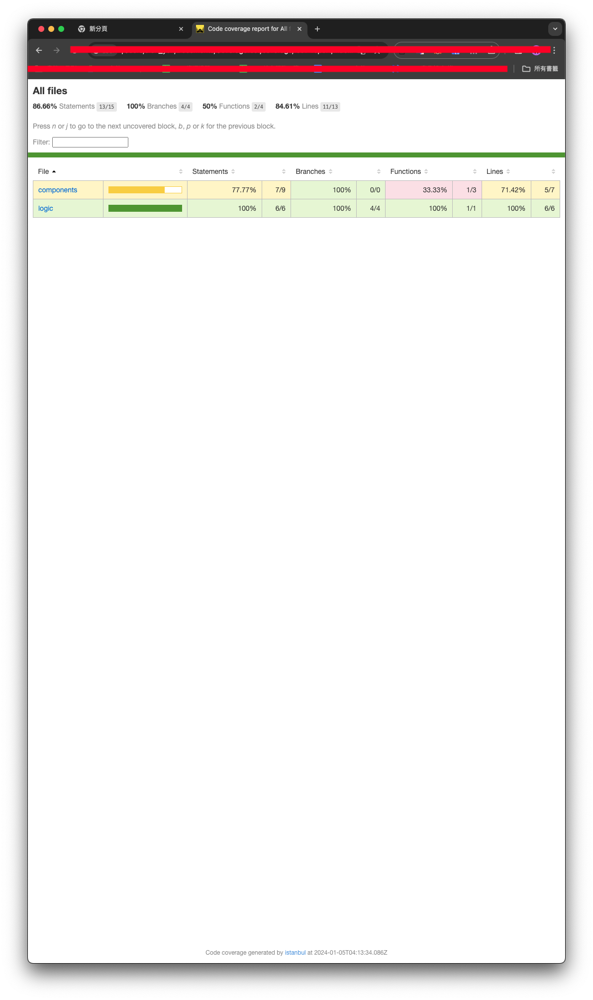

# 在cocos creator 3.8專案中使用jest作為test撰寫工具並產生測試覆蓋率報告的sample

## 如何開始跑測試＆產生覆蓋率報告
```
npm run test
```

## 環境安裝

- npm i --save-dev jest
- npm i --save-dev ts-jest
- npm i --save-dev @types/jest

## package.json新增便捷的script，已變執行 npm run test

詳見package.json中的scripts: { ... }

## 手動新增jest.config.js

### 以下逐行解釋 （盡量XD）
```js
module.exports = {
  preset: 'ts-jest',
  testEnvironment: 'node', // 用node運行，縱使專案實際上跑在browser
  collectCoverage: true, // 要自己開啟才會產生coverage報告，目錄在coverage/Icov-report
  roots: ['<rootDir>/assets'], // 預設通常是src，但在cocos我們指向assets，當然你也可以只對 assets/scripts/之類的
  transform: { // 不確定，但是tsx印象中是一種模板寫法，我們用不到，測試過移除也可以跑，但我還是保留
    '^.+\\.tsx?$': 'ts-jest',
  },
  testRegex: '(/__tests__/.*|(\\.|/)(test|spec))\\.tsx?$', // 關鍵之一，用正規表示式辨別哪些code是測試檔案，以這邊為例就是assets底下有放在__tests__底下且檔名含有xxx.test.ts的都算
  moduleFileExtensions: ['ts', 'tsx', 'js', 'jsx', 'json', 'node'], // 這裡應該是延伸去判斷有哪些副檔名會被測試檔案給使用到，待測試
  moduleNameMapper: {
    '^cc$': '<rootDir>/__mocks__/ccMock.js',  // 關鍵之二將，'cc' 導向到模擬文件。 這樣才不會想驗證一下component的functinos不認得cc
  },
};
```

## 覆蓋率報告閱覽
產生在根目錄底下的coverage/Icov-report/index.html，拖曳到瀏覽器就可以看了例如：


